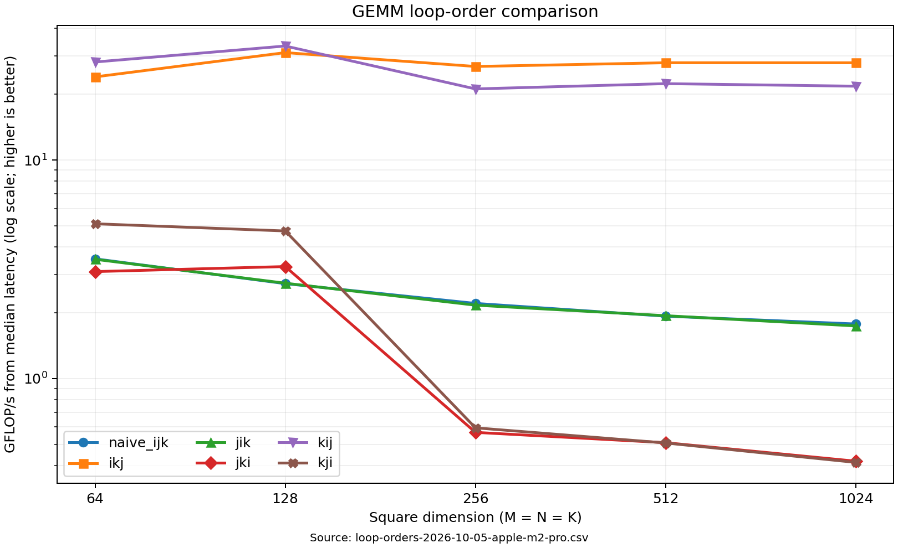
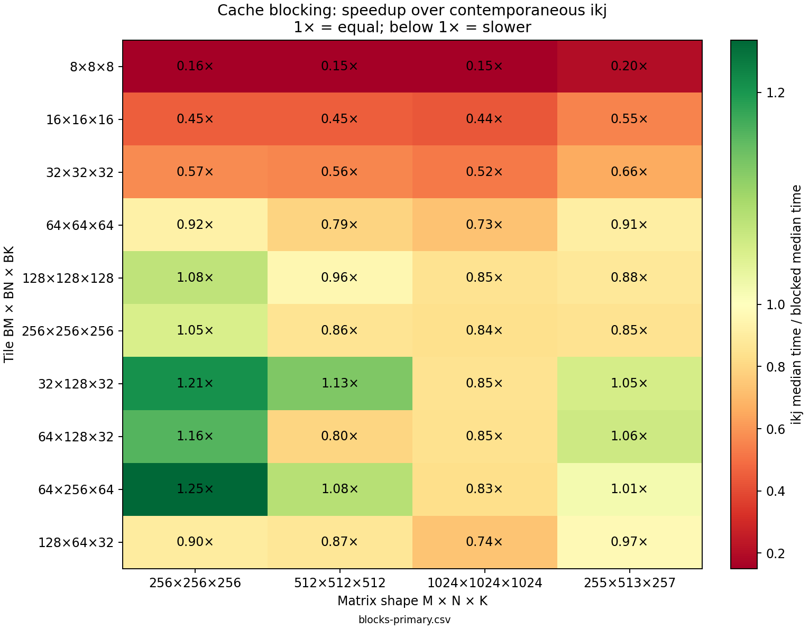
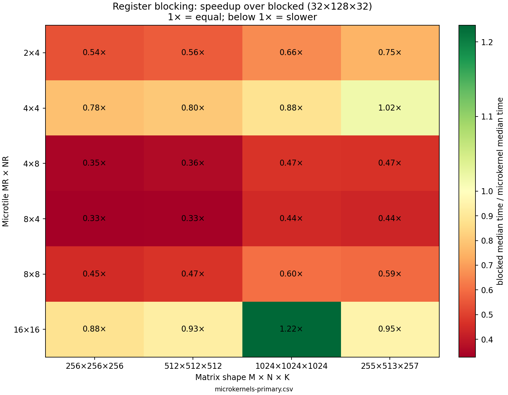
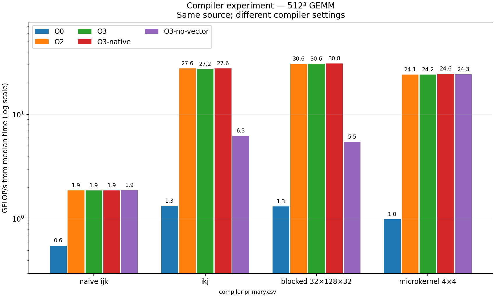
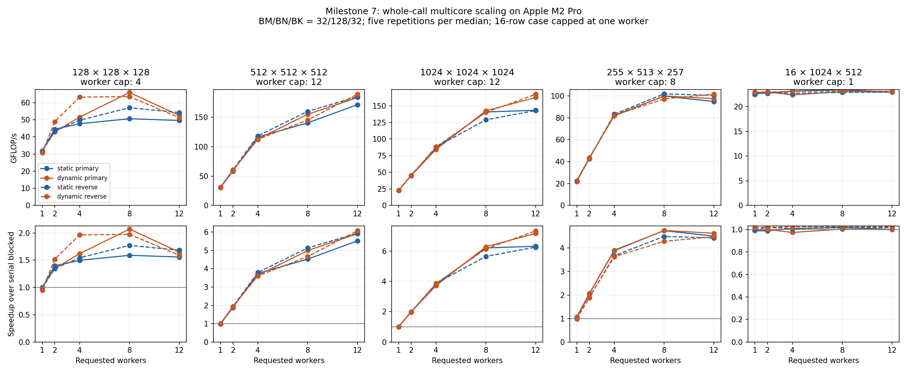

# GEMM from first principles

A C++17 performance-engineering project that starts with a correct, deliberately
naive matrix multiplication and advances through measured experiments. This is
**Milestone 7**: contiguous row-major `float` matrices, a scalar reference with
double accumulation, all six loop orders, configurable cache and register blocking,
controlled K-loop unrolling, compiler/vectorization experiments, multicore row-strip scheduling,
correctness tests, and a CSV benchmark.
The original `naive_ijk` remains the unchanged Milestone 1 kernel.

All kernels compute **C = A × B** for A[M,K], B[K,N], and C[M,N]. C is overwritten.
The hot loops operate on raw pointers without allocation. Buffers must have valid
extents, index products must fit `size_t`, and C must not overlap either input.
Zero M or N performs no accesses; zero K writes zeros to C. Matrix indexing is
unchecked; construction checks dimension multiplication for overflow.

## Build and test

Requires CMake 3.20+ and a C++17 compiler. No external numerical library is needed.

```sh
cmake -S . -B build/debug -DCMAKE_BUILD_TYPE=Debug
cmake --build build/debug --parallel
ctest --test-dir build/debug --output-on-failure

cmake -S . -B build/release -DCMAKE_BUILD_TYPE=Release
cmake --build build/release --parallel
ctest --test-dir build/release --output-on-failure
```

These commands use a single-configuration generator. For multi-configuration
generators, select `--config Release` when building and `-C Release` with CTest.
Release uses the compiler's CMake optimization defaults. Optional
`-DGEMM_NATIVE_ARCH=ON` enables checked host tuning (`-mcpu=native` on ARM or
`-march=native` elsewhere); it is off by default for portability. Do not distribute
host-tuned binaries assuming they work on other CPUs. No fast-math flags are added.

Tests use explicit checks even in Release, including known answers, both identity
directions, zeros, negative values, odd/rectangular random shapes, and K=0.
Random comparisons use `abs(actual - expected) <= 1e-4 + 1e-4 * abs(expected)`
and reject non-finite results. This tolerance targets the bounded inputs tested
here, not an arbitrary numerical error guarantee.

## Benchmark

```sh
./build/release/gemm_benchmark > results/raw/loop-orders.csv
./build/release/gemm_benchmark --repetitions 7 64 128 256 512
./build/release/gemm_benchmark --implementation naive_ijk 64 128 256 512
./build/release/gemm_benchmark --implementation ikj --repetitions 7 512
./build/release/gemm_benchmark --implementation blocked --bm 64 --bn 128 --bk 32 512
./build/release/gemm_benchmark --implementation blocked --bm 32 --bn 128 --bk 32 --shape 255 513 257
./build/release/gemm_benchmark --implementation microkernel --bm 32 --bn 128 --bk 32 --mr 4 --nr 4 512
./build/release/gemm_benchmark --implementation microkernel --bm 32 --bn 128 --bk 32 --unroll 4 512
```

Defaults: all six orders; square sizes 64, 128, 256, 512, 1024; one warmup;
five measured runs per implementation/size. Select one with `--implementation`
(`naive_ijk`, `ikj`, `jik`, `jki`, `kij`, `kji`), or use `all`.
Select `blocked` or `microkernel` explicitly; `all` keeps its original six-order
meaning. Block dimensions are positive independent runtime parameters, defaulting
to 64 each for convenience. Block options require `blocked` or `microkernel`.
Microtile options `--mr`/`--nr` require `microkernel`, default to 4×4, and support
2×4, 4×4, 4×8, 8×4, 8×8, or 16×16 (a register-pressure experiment).
`--unroll 1|2|4|8` requires `microkernel`; factors greater than 1 require 4×4.
Factor 1 remains the default and uses the unchanged Milestone 4 body.
`--shape M N K` supports one rectangular problem instead of positional sizes.
Positive sizes and repetition counts are configurable. Very small sizes are useful
for smoke checks, but timer overhead makes them unsuitable performance evidence.
Large sizes can take substantial time and memory (four N×N float matrices).

The harness allocates and initializes outside timing, validates the warmup against
the reference, and times the selected kernel using `std::chrono::steady_clock`.
Required C zeroing is inside the four accumulating kernels and included in timing.
Blocked GEMM includes its initialization too. The shared harness calls unblocked
kernels through a function pointer and blocked/microkernel GEMM through argument adapters.
Implementations run
in the listed order for each size; repetitions are consecutive, not interleaved.
It reports median milliseconds (averaging the middle pair for even counts) and
`2*M*N*K / (seconds*1e9)` GFLOP/s. Each timed result contributes to the printed
double checksum outside timing. Input seeds are fixed at 42 and 43; the generator
maps mt19937 output directly to binary fractions in [-1,1).

CSV columns are `implementation,M,N,K,time_ms,gflops,repetitions,warmups,threads,seed_A,seed_B,checksum,BM,BN,BK,MR,NR,unroll,schedule,requested_threads`.
Macro dimensions are zero for unblocked kernels; micro dimensions are zero for
non-microkernel implementations, as is `unroll`. Earlier saved CSVs predate these appended columns.
Diagnostics go to stderr. A failed run returns nonzero and may leave a partial CSV;
do not treat that file as a complete result. Checksums sum all measured outputs, so
they scale with repetition count. They are an output-consumption guard, not a
replacement for element-wise correctness tests.

This measures repeated use of the same buffers, with no cache flush or affinity
control. Checksum reads affect cache state between runs. Compiler optimizations
(including automatic vectorization, unrolling, or FMA) remain enabled in Release;
“naive” describes the source algorithm. Record the compiler, flags, machine,
OS, and command alongside any retained CSV; `compile_commands.json` records compile
commands for supported generators. Do not compare Debug timings to Release.

## Progression

See [the project charter](docs/project_charter.md),
[experiment log](docs/optimization_log.md), and
[loop-order analysis](docs/loop_orders.md), [cache-blocking experiment](docs/cache_blocking.md),
the [microkernel experiment](docs/microkernels.md), [unrolling experiment](docs/unrolling.md),
and [compiler analysis](docs/compiler_analysis.md)
for access patterns, design choices, cache capacities, and measured results.
Explicit SIMD remains an optional follow-up; Milestone 7 adds multicore execution.

Regenerate the comparison plot with Python 3 and matplotlib (plotting is optional
and is not a C++ build dependency):

```sh
python3 scripts/plot_results.py results/raw/loop-orders-2026-10-05-apple-m2-pro.csv
```

Repeat in reverse implementation order with the standard-library-only runner:

```sh
python3 scripts/run_benchmarks.py --reverse --output results/raw/loop-orders-reverse.csv
```

This runner starts a fresh process per implementation/size and executes them
sequentially. The warmup and timed region stay inside the C++ executable.



The fixed Milestone 3 sweep compares ten tiles against contemporaneous `ikj`
on three square sizes and one odd rectangular shape:

```sh
python3 scripts/benchmark_blocks.py --output results/raw/blocks-primary.csv
python3 scripts/benchmark_blocks.py --reverse --output results/raw/blocks-reverse.csv
python3 scripts/plot_blocks.py results/raw/blocks-primary.csv
```

The blocking experiment is retained even where it regresses; no universal winning
tile or automatic dispatch policy is inferred from these few shapes.



Milestone 4 holds the macro tile at 32×128×32, measures six microtiles, and inspects
actual optimized assembly for accumulator residency and hot-loop spills:

```sh
python3 scripts/benchmark_microkernels.py --output results/raw/microkernels-primary.csv
python3 scripts/benchmark_microkernels.py --reverse --output results/raw/microkernels-reverse.csv
python3 scripts/plot_microkernels.py results/raw/microkernels-primary.csv
```

The implementation is scalar C++ source; compiler-generated SIMD/FMA is permitted.
See the [assembly findings and measured limitations](docs/microkernels.md) before
assuming a larger tile or a local accumulator array means faster register code.



Milestone 5 compares K-unroll factors 1/2/4/8 with microtile 4×4 and macro tile
32×128×32 held fixed. The old factor-1 body remains available and unchanged:

```sh
python3 scripts/benchmark_unroll.py --output results/raw/unroll-primary.csv
python3 scripts/benchmark_unroll.py --reverse --output results/raw/unroll-reverse.csv
python3 scripts/plot_unroll.py results/raw/unroll-primary.csv
```

See [the report](docs/unrolling.md) for machine-code expansion, code growth,
tail correctness, and measured tradeoffs. Manual unrolling is retained as an
experiment, not assumed to be faster.


Milestone 6 compares O0/O2/O3/native and a vectorization-disabled control with
unchanged kernel source. The preparation script requires Clang, saves remarks
and assembly, and runs all correctness suites before measurement:

```sh
python3 scripts/compiler_experiment.py prepare --cmake cmake --compiler /usr/bin/clang++
python3 scripts/compiler_experiment.py benchmark --output results/raw/compiler-primary.csv
python3 scripts/compiler_experiment.py benchmark --reverse --output results/raw/compiler-reverse.csv
python3 scripts/plot_compiler.py results/raw/compiler-primary.csv
```

The compiler-study CSV prepends a `build` column to the usual benchmark columns.
Use a fresh preparation after source edits. Assembly summaries are specific to
the recorded ARM64 output. For ordinary builds, diagnostics are optional:
`-DGEMM_VECTORIZATION_REPORTS=ON` emits Clang remarks or GCC vector reports.
Native tuning remains OFF by default and no fast-math policy is introduced.




Milestone 7 adds `parallel`, which reuses the blocked numerical kernel with
static or dynamic ownership of BM-row strips. Thread startup and joining are
included in timing; `--threads` counts the caller. Worker count is capped by the
number of row strips. CSV adds `schedule` and `requested_threads`, while `threads`
records the capped count. Earlier implementations remain available.

```sh
build/release/gemm_benchmark --implementation parallel --threads 8 --schedule static --bm 32 --bn 128 --bk 32 1024
python3 scripts/benchmark_parallel.py --binary build/release/gemm_benchmark --output results/raw/parallel-primary.csv
python3 scripts/benchmark_parallel.py --binary build/release/gemm_benchmark --reverse --output results/raw/parallel-reverse.csv
python3 scripts/plot_parallel.py
```

See [the multicore report](docs/parallel.md) for scaling, scheduling tradeoffs,
validation, and the short/wide limitation of row-strip ownership.




## Milestone 8 — hardware profiling (provisional counter findings)

Both eight-case hardware-counter sweeps have been captured and analyzed. At
512³, scalar 4×4 reports about 6.4 IPC versus blocked's 4.4, yet remains slower:
IPC alone does not measure useful numerical work. Twelve-worker runs report
about 8.3–8.7 CPU-equivalents, with mixed core types. Every capture also contains
an unlocalized collector underflow warning, so counter findings remain
**provisional**. See [results, methodology and limitations](docs/profiling.md).

```sh
cmake -S . -B build/m8-release -DCMAKE_BUILD_TYPE=Release
cmake --build build/m8-release --parallel
ctest --test-dir build/m8-release --output-on-failure
python3 tests/test_profile_protocol.py build/m8-release/gemm_benchmark
sudo -v
python3 scripts/profile_counters.py --output results/profiling/counters-primary
python3 scripts/profile_counters.py --reverse --output results/profiling/counters-reverse
```

Run these locally as your normal user; only the collector uses administrator
access. Profiling mode validates before and after a sustained workload and emits
a separate CSV with average throughput. Captures retain raw samples, target PID,
phase timestamps and build metadata. Raw captures are preserved; ordinary smoke runs contain no hardware counters.
Reproduce the reviewed analysis without administrator access:

```sh
python3 scripts/analyze_counters.py results/profiling/counters-primary results/profiling/counters-reverse --output results/profiling/analysis.json
PYTHONDONTWRITEBYTECODE=1 python3 tests/test_counter_analysis.py
```

The analysis records six or seven interior samples per case and retains warning
flags. Cache misses and DRAM bandwidth were not measured.
