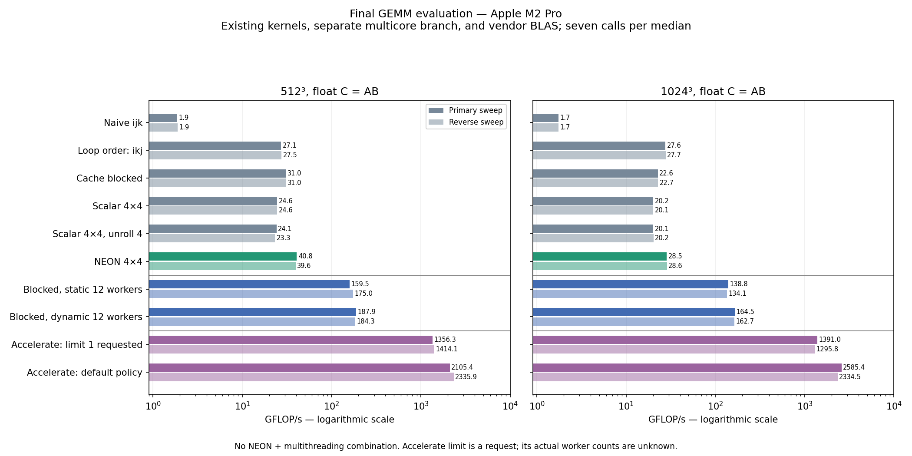
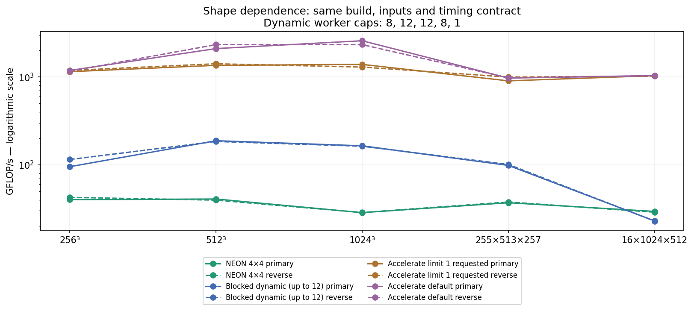

# Final evaluation and project conclusions

The CPU learning/evaluation phase is closed as of 2026-10-09. This pass adds an
optional vendor comparator and evaluation artifacts, not another optimization.
The project demonstrates a measured progression from naive GEMM to SIMD and
multicore execution, while preserving experiments that did not improve speed.
It remains substantially behind Apple Accelerate on this machine.

## Headline result

On Apple M2 Pro at 512³, the final matched runs measured:

- Naive: **1.87–1.88 GFLOP/s**.
- Single-thread NEON 4×4: **39.56–40.75 GFLOP/s**, **21.05–21.80×** naive.
- Twelve-worker dynamic blocked: **184.28–187.90 GFLOP/s**, **98.03–100.52×** naive.
- Apple Accelerate, default policy: **2,105.38–2,335.91 GFLOP/s**.

Our parallel implementation reaches **7.89–8.92%** of default-policy Accelerate
throughput at this size. These ratios pair numerator and denominator within the
same sweep. Ranges are two observed medians, not confidence intervals or universal
performance guarantees. The parallel implementation uses the blocked kernel;
it does **not** combine NEON with multithreading.



## Matched experiment

All major existing paths were rebuilt together in Release using Apple Clang
14.0.3, `-O3 -DNDEBUG`, no native tuning, no fast-math and no LTO. Hardware/OS:
Apple M2 Pro, 12 CPU cores, 16 GiB, macOS 14.8.3, arm64. Accelerate uses the system
framework and the installed SDK's `ACCELERATE_NEW_LAPACK` CBLAS interface, with
32-bit dimensions. The optional comparator is separate from the portable kernel
library; it is disabled by default.

The final sweep compares naive, ikj, blocked, scalar 4×4, scalar unroll-4, NEON
4×4, static/dynamic blocked with twelve requested workers, and two Accelerate
policies. Shapes are 256³, 512³, 1024³, 255×513×257 and 16×1024×512. Both sweeps
use the same source/binary hashes; the second reverses implementation order within
each shape. Every case runs in its own fresh process, sequentially, with seven
calls per median and one double-reference-validated warmup. All 100 guards passed.

All kernels compute float row-major C=AB with seeds 42/43. BM/BN/BK is fixed at
32/128/32; microtiles are 4×4, with explicit factor 1 or 4. Timing includes the
entire GEMM call and required output initialization. The parallel path includes
thread creation/join; the BLAS call includes its internal setup. Matrix allocation,
reference computation and per-call checksums are outside timing. Buffers are
reused and warmed. There is no affinity, cold-cache, frequency or thermal control.
Default parallel worker caps are 8, 12, 12, 8, and 1 for the five shapes.

The BLAS adapter invokes `cblas_sgemm` with row-major/no-transpose, alpha=1,
beta=0, lda=K, ldb=N and ldc=N. No external transpose, packing or extra C zeroing
is added. Zero K and empty outputs preserve the project contract, and dimensions
above INT_MAX are rejected before narrowing. Apple documents row-major leading
dimensions as the second matrix dimension: [BLAS documentation](https://developer.apple.com/documentation/accelerate/blas-library).

### BLAS thread-policy qualification

Each subprocess clears inherited `VECLIB_MAXIMUM_THREADS`. One Accelerate case
sets it to 1; the other leaves it unset. They are labeled **limit 1 requested**
and **default policy**. This SDK has no BLASSetThreading declaration, and we did
not measure the library's actual worker count. Benchmark CSV uses threads=0 and
requested_threads=0 to mean library-managed/unknown; the evaluation CSV and
metadata separately preserve the environment request. Do not interpret 0 as zero
execution threads or the environment request as verified single-core execution.

The default policy is appreciably faster at larger sizes, but timing alone does
not identify its workers, instruction set, or internal algorithm. Accelerate may
use a different platform execution path; the comparison is against the production
library's delivered performance, not an isolated comparison of NEON efficiency.
Even the limit-1-requested case is not a verified like-for-like single-core test.

## Progression measurements

Values below are primary / reverse GFLOP/s, all from this final build. The
historical compiler-flag and profiling milestones are interpretive experiments;
they do not become additional cumulative kernel stages on the graph.

| Implementation | 512³ | 1024³ |
|---|---:|---:|
| Naive ijk | 1.87 / 1.88 | 1.74 / 1.74 |
| ikj | 27.09 / 27.51 | 27.59 / 27.70 |
| Cache blocked | 30.97 / 30.98 | 22.60 / 22.73 |
| Scalar 4×4 | 24.61 / 24.62 | 20.15 / 20.07 |
| Scalar 4×4, unroll 4 | 24.15 / 23.32 | 20.14 / 20.24 |
| NEON 4×4 | 40.75 / 39.56 | 28.50 / 28.59 |
| Blocked, static 12 | 159.46 / 174.98 | 138.77 / 134.10 |
| Blocked, dynamic 12 | 187.90 / 184.28 | 164.47 / 162.65 |
| Accelerate, limit 1 requested | 1,356.31 / 1,414.06 | 1,390.97 / 1,295.84 |
| Accelerate, default policy | 2,105.38 / 2,335.91 | 2,585.38 / 2,334.54 |

At 1024³, the dynamic implementation achieves **93.26–94.41×** naive and
**6.36–6.97%** of default-policy Accelerate. Single-thread NEON achieves about
**16.4×** naive, but is only slightly faster than ikj. Increasing problem size
does not guarantee that the chosen blocked layout or NEON body pulls farther ahead.

| Other shape M×N×K | NEON 4×4 | Dynamic blocked (capped workers) | Accelerate default |
|---|---:|---:|---:|
| 256³ | 40.03 / 42.54 | 95.07 / 114.88 (8) | 1,186.00 / 1,163.75 |
| 255×513×257 | 36.97 / 37.67 | 98.35 / 100.81 (8) | 971.55 / 977.44 |
| 16×1024×512 | 29.43 / 28.82 | 22.93 / 22.84 (1) | 1,037.74 / 1,032.44 |

The short/wide case illustrates a structural limit: BM=32 exposes only one row
strip, so the multicore path cannot scale and loses to NEON and ikj. At 256³,
static versus dynamic ranking changes between runs. No universal scheduler or
shape-independent dispatch policy follows from this evaluation.

One short/wide unroll-4 median was 12.09 GFLOP/s versus 20.64 in reverse order.
Three targeted follow-ups measured 19.80–20.58, so the low value did not reproduce.
Its cause is unknown. The original data and all twelve follow-up cases are
preserved; the anomaly was not removed or replaced in the final dataset.



## What each milestone established

1. **Baseline and correctness:** contiguous storage, double reference, tolerance
   checks, deterministic inputs and repeatable whole-call timing made later
   comparisons meaningful. A checksum prevents unused results, but does not
   replace elementwise validation.
2. **Loop order:** changing traversal produced the largest simple single-core
   improvement. Contiguous inner-j access also enabled compiler vectorization;
   locality and instruction generation both matter.
3. **Cache blocking:** benefits depend on problem and tile shape. The fixed tile
   beats ikj at 512³ but loses at 1024³. Cache-capacity reasoning is a hypothesis,
   not proof that a chosen block is optimal.
4. **Register microkernel:** retaining accumulators in registers is useful but
   insufficient. The scalar 4×4 trails compiler-vectorized blocked GEMM; larger
   scalar tiles in the earlier experiment spilled. Source accumulator arrays do
   not guarantee register allocation or throughput.
5. **K unrolling:** larger source bodies did not establish a reliable general
   improvement. Static code expansion, dependencies and register pressure must
   be inspected; manual unrolling is not automatically beneficial.
6. **Compiler study:** disabling vectorization substantially reduced contiguous
   loop throughput. Selected native and O3 instruction bodies matched, so no
   native-tuning benefit was established. Compiler reports require assembly
   context—the naive kernel's reported vector path was a special N=1 case.
7. **Multicore:** independent output ownership avoids arithmetic synchronization
   and gives substantial speedup. Row-strip granularity, heterogeneous core
   scheduling and lifecycle overhead limit generality. Dynamic scheduling helps
   some cases but is not universally better.
8. **Profiling:** a real capture/analysis workflow produced repeatable IPC
   observations, including higher scalar-microkernel IPC despite lower throughput.
   Every capture had an unlocalized underflow warning, so counter conclusions
   remain provisional. Cache misses and DRAM bandwidth were not measured.
9. **Explicit NEON:** four vector accumulators combine output reuse and four-wide
   arithmetic. Assembly confirms four vector FMAs per K step and no hot-loop
   spills. Matched-driver measurements show a gain over scalar and blocked on
   the tested full-tile-heavy shapes.
10. **Vendor comparison and closure:** the educational implementation is far
    faster than its naive baseline, yet remains far behind Accelerate. That gap
    is measured, not hidden by comparing only against the weakest baseline.

This list follows the experiments, not a renumbering of the original charter.
Details and earlier raw measurements remain in their milestone reports.

## Final conclusions and limits

The project succeeded as a performance-engineering study: the same mathematical
operation acquired very different throughput through traversal, compiler SIMD,
register use and multicore ownership. The results also establish the value of
rejecting plausible optimizations when measurements do not support them.

The Accelerate gap is not explained by a single measured cause. Our kernels lack
packing, persistent worker pools, tuned shape dispatch and combined NEON/multicore
execution. Those are known differences in our implementation, not a proven
breakdown of the vendor speed advantage. Vendor-specific execution choices were
not inspected. No claim about AMX use, cache-miss reduction, bandwidth saturation,
peak-hardware utilization or parity with production BLAS is justified here.

The portable API still focuses on contiguous, non-transposed float C=AB. There
is no general alpha/beta interface, transpose support, GPU path or autotuning.
No changes to those scopes are needed to close this phase. Existing defaults
remain explicit and earlier implementations remain benchmarkable.

A defensible project description is: “Built and evaluated a C++17 GEMM engine
through loop ordering, blocking, register tiling, compiler analysis, NEON and
multicore experiments. On M2 Pro at 512³, measured roughly 21–22× naive throughput
with single-thread NEON and 98–101× with twelve-worker blocked GEMM; independently
validated results and quantified the remaining gap to Apple Accelerate.”

## Reproduction and artifacts

```sh
cmake -S . -B build/final-release -DCMAKE_BUILD_TYPE=Release -DGEMM_BENCHMARK_ACCELERATE=ON
cmake --build build/final-release --parallel
ctest --test-dir build/final-release --output-on-failure
python3 scripts/evaluate_final.py --output results/raw/final-primary.csv
python3 scripts/evaluate_final.py --reverse --output results/raw/final-reverse.csv
python3 scripts/summarize_final.py
```

Use new CSV filenames for reruns; the runner refuses overwrites. The summarizer
reads the named primary/reverse files and validates coverage, matching builds,
GFLOP/s arithmetic, seeds and repetition settings before producing ratios and
plots. Exact compilation/link commands, source/binary hashes and per-case vecLib
policy are in the adjacent metadata. `results/final-summary.json` contains all
five shapes and matched ratios, with raw CSV hashes.

Accelerate is optional (`GEMM_BENCHMARK_ACCELERATE=OFF` by default). Enabled and
disabled Release builds passed all five correctness suites. Adapter tests cover
rectangular inputs, NaN overwrite, repeated calls, guards, input preservation,
empty dimensions, K=0 and integer-range rejection. The existing project reference
checks every comparison, including BLAS; seven repetitions use the same inputs.
The full sweeps passed 100 guards and the follow-up passed twelve more.

No algorithmic optimization, default selection change, or takeaways edit was
made during this closure pass.
