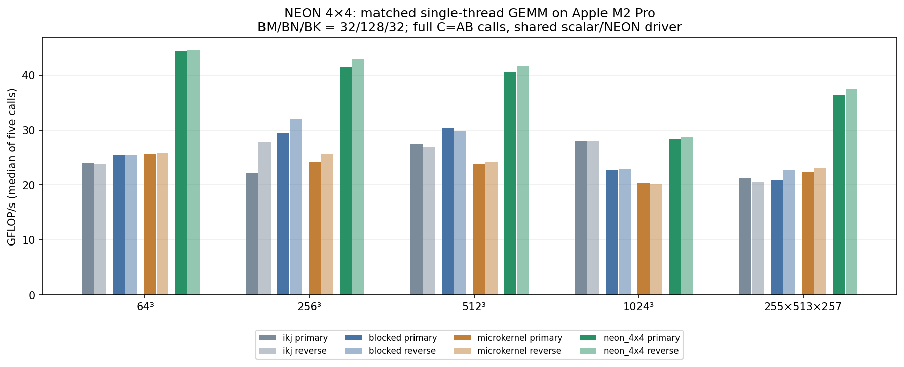

# Explicit NEON 4×4 microkernel

This closes the deferred explicit-SIMD experiment from Milestone 6, after the
multicore and profiling milestones. It is a single-thread kernel comparison,
not a new threading, packing, or tuning policy.

## Hypothesis and implementation

The existing scalar 4×4 microkernel keeps 16 output accumulators in registers,
but the measured compiler emits 16 scalar FMAs for each K step. Four-wide FP32
NEON arithmetic should combine that reuse with fewer arithmetic instructions,
closing or exceeding its throughput gap to compiler-vectorized blocked GEMM.
Repeatable regression, failure to beat blocked, or hot-loop spills would argue
against the corresponding performance hypothesis on a tested configuration.

`src/microkernel_neon.cpp` implements four `float32x4_t` accumulators, one per
output row. Lanes correspond to four adjacent columns. Each K step loads one
contiguous B vector and reuses it across four scalar A values, issuing four
`vfmaq_n_f32` operations. This performs 16 multiplies and 16 adds (32 FLOPs) per
K step. There is no horizontal reduction: each lane preserves its own K-order.
C is loaded before the K block and stored after it, preserving earlier partial
sums. Vector loads/stores require valid float storage but no 16-byte alignment.

The shared `microkernel_driver.cpp` keeps the earlier ii/kk/jj traversal,
zeroing, indirect per-tile call, and scalar edge cleanup. Only complete 4×4 tiles
enter the NEON body. Partial matrix or macroblock edges use bounded scalar
cleanup. K advances one element per iteration, so any K-block length works
without a vector-width divisibility constraint. K=0 leaves C zero without
accessing A/B. Explicit FMA has fused rounding; scalar tails/builds need not be
bitwise identical, and correctness uses the existing double-reference tolerance.

Design choices are deliberately fixed: MR/NR=4/4, unroll=1, no packing, no new
alignment/restrict assumptions, and no NEON integration into the parallel kernel.
A wider NR or K unrolling would change register pressure and dependencies; those
are separate experiments. Four vector accumulators also mean four accumulator
dependency chains, so a fourfold whole-GEMM speedup is not assumed.

## Shared-driver control

An initial same-translation-unit driver was specialized by Clang for the fixed
NEON caller, producing direct tile calls, while the scalar caller remained
generic. That would mix driver specialization with the intended arithmetic
comparison. The final driver is in its own translation unit, built without LTO.
Both entry points call the same `detail::microkernel_impl` with a tile function
pointer and runtime MR/NR. Assembly confirms indirect tile calls in that body.

The initial results are retained in `neon-specialized-primary/reverse.csv`, with
metadata and `gemm_microkernel-specialized.s`. The results below and the plot use
only the final matched-driver sweeps. Scalar tile source is unchanged; earlier
benchmark numbers are not substituted for freshly measured comparators.

## Build and reproduce

```sh
cmake -S . -B build/neon-release -DCMAKE_BUILD_TYPE=Release
cmake --build build/neon-release --parallel
ctest --test-dir build/neon-release --output-on-failure
build/neon-release/gemm_benchmark --implementation neon_4x4 --bm 32 --bn 128 --bk 32 512
python3 scripts/benchmark_neon.py --output results/raw/neon-primary.csv
python3 scripts/benchmark_neon.py --reverse --output results/raw/neon-reverse.csv
python3 scripts/inspect_neon.py
python3 scripts/plot_neon.py
```

The benchmark script refuses to overwrite a CSV; use new output filenames when
repeating an experiment. The assembly summarizer targets the recorded Apple
Clang ARM64 syntax/loop labels and needs review on other compilers. The raw
assembly and exact generation commands are retained alongside the summary.

`GEMM_ENABLE_NEON` defaults ON, with a compile-time AArch64/intrinsics check.
`-DGEMM_ENABLE_NEON=OFF` builds without the intrinsic body. `neon_available()`
reports build capability. On disabled/unsupported builds, `neon_4x4` throws before
buffer access, rather than silently falling back to a mislabeled scalar kernel.
This is not runtime CPU dispatch. Existing kernels remain portable and available;
`--implementation all` still means the original six loop orders.

## Assembly evidence

Actual Release flags: Apple Clang 14.0.3, `-O3 -DNDEBUG -std=c++17`, native tuning
OFF, no fast-math or LTO, on Apple M2 Pro / macOS 14.8.3. Commands are generated
from compile_commands.json; numerical source and binary hashes are saved with
each benchmark sweep.

| Hot K loop | Scalar 4×4 | NEON 4×4 |
|---|---:|---:|
| Arithmetic instructions per K step | 16 scalar `fmadd` | 4 vector `fmla.4s` |
| Total static loop instructions | 26 | 13 |
| Output accumulators | 16 scalar registers | v0–v3, four vector registers |
| Hot-loop stack accesses | None | None |
| Hot-loop helper calls | None | None |

NEON assembly loads B into q4, broadcasts the first A scalar with `ld1r.4s`, and
uses scalar-lane FMAs for the other rows. All four accumulator vectors stay live
through K; there is no stack frame or spilling in the tile body. C is accessed
only before/after the reduction loop. These are static assembly observations,
not PMU instruction counts or proof of fourfold dynamic throughput.

## Matched results

One thread, BM/BN/BK=32/128/32, MR/NR=4/4, unroll=1. Each case is a fresh process
with deterministic inputs, a reference-validated warmup, then five whole-call
measurements summarized by their median. Zeroing and tile dispatch are timed;
input setup, reference and checksums are outside timing. Cases run serially.
The second sweep reverses implementation order within each shape. No affinity
or frequency controls were used; these are two observations, not confidence
intervals. Reported values are primary / reverse GFLOP/s.

| Shape M×N×K | Scalar 4×4 | Blocked | NEON 4×4 | NEON / scalar | NEON / blocked |
|---|---:|---:|---:|---:|---:|
| 64³ | 25.68 / 25.73 | 25.47 / 25.47 | 44.46 / 44.62 | 1.73× / 1.73× | 1.75× / 1.75× |
| 256³ | 24.18 / 25.54 | 29.58 / 32.02 | 41.42 / 42.97 | 1.71× / 1.68× | 1.40× / 1.34× |
| 512³ | 23.80 / 24.06 | 30.39 / 29.80 | 40.58 / 41.57 | 1.70× / 1.73× | 1.34× / 1.39× |
| 1024³ | 20.45 / 20.18 | 22.83 / 23.02 | 28.40 / 28.67 | 1.39× / 1.42× | 1.24× / 1.25× |
| 255×513×257 | 22.40 / 23.13 | 20.87 / 22.75 | 36.32 / 37.56 | 1.62× / 1.62× | 1.74× / 1.65× |

The full-tile-heavy configurations support the hypothesis in both sweeps: NEON
beats scalar 4×4 and blocked. At 1024³, however, ikj reaches 28.00/28.02 GFLOP/s,
so NEON is only about 1.4%/2.3% ahead of that simpler comparator. No robust large
advantage over ikj or universal winner is established there.

The 3×5×257 control has no complete four-row tile and thus executes no NEON
arithmetic. NEON-labeled and scalar microkernel throughput is 4.745/4.745 versus
4.625/4.745 GFLOP/s (roughly 1.6–1.7 microseconds per call). Their tiny difference
is not SIMD evidence; the shared scalar cleanup dominates. Small timings,
including the roughly 12-microsecond 64³ NEON calls, deserve particular caution.

The observed gains are below 4×: loads, loop control, dispatch, scalar tails,
macroblock C reload/store, cache behavior and accumulator dependencies remain.
Their individual contributions were not isolated. Earlier profiler underflow
warnings are not used as evidence for this experiment; no new hardware-counter
claims are made.



## Correctness and decision

All four correctness suites passed in Release, Debug, ASan/UBSan, and a
NEON-disabled Release build. Tests cover existing known answers, empty extents,
K=0/null inputs, invalid tiles, repeated calls, input preservation, NaN overwrite,
output guards and SIZE_MAX macrotiles. NEON-specific additions cover M/N=1..9,
varied K/BK tails, offsets of one float for all buffers, and a cancellation case
that distinguishes fused arithmetic from separate multiply/add. The vector body
and scalar cleanup both run under sanitizers. Unsupported-platform behavior was
tested with NEON disabled on this Mac; no x86 machine was used.

Both final sweeps passed 48 warmup reference guards; the preserved initial sweeps
also passed 48. CLI checks reject incompatible microtile/unroll/thread options
for the fixed NEON kernel. The profiling mode remains usable with neon_4x4.

Decision: retain NEON as an explicit benchmarkable implementation. The experiment
successfully combines register reuse with SIMD and exceeds blocked throughput on
the tested full-tile-heavy shapes. Preserve scalar kernels and defaults; do not
infer a tuned dispatch policy, packing requirement, or multicore NEON result.
