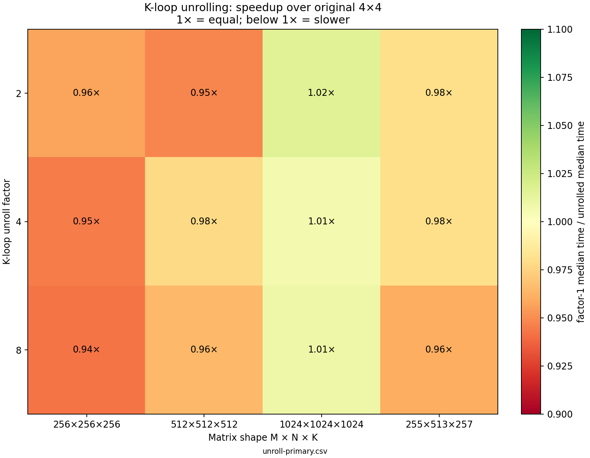

# Milestone 5 — controlled K-loop unrolling

## Hypothesis and design

Reduce loop-control work and expose more instructions to scheduling by expanding
the 4×4 microkernel's K loop by factors 2, 4, and 8. Compare against the unchanged
factor-1 tile from Milestone 4, with macro dimensions fixed at 32/128/32. Expected
result: improved throughput without accumulator spills. No improvement, a
regression, or new hot-loop spills would challenge that expectation. Compiler
assembly must first confirm whether the requested expansion actually survived.

All factors use the same sixteen accumulators and preserve each output's
increasing-K accumulation order. No split reduction chains, new microtile shape,
packing, intrinsics, or compiler-flag changes are mixed into the experiment.
This isolates a narrower question than whether unrolling plus reassociation or
different register blocking could help. Earlier microtile bodies are unchanged.

`src/microkernel_unrolled.cpp` expresses one K update in a small `step` helper
and explicitly calls it at consecutive offsets. `if constexpr` selects a fixed
number of steps; it is not a runtime sub-loop. The compiler is expected to inline
the helper, but no forced-inline attributes or unroll pragmas are used.

The driver chooses the function once per GEMM. Factors 2/4/8 only support 4×4;
factor 1 supports all earlier shapes and remains the default. Macro dimensions
stay independently configurable, with the existing CLI convenience defaults.
The indirect per-microtile calls and C initialization remain inside timing.

## Semantics and tails

The full group runs only when `depth - k >= U`. Since k stays at or below depth,
this avoids overflow in `k + U` and never reads beyond the current K block.
Scalar cleanup handles the remaining 0…U−1 values, including K blocks shorter
than U. Loading C before the reduction preserves partial sums from earlier macro
blocks. Partial M/N microtiles still use the existing scalar cleanup and do not
benefit from the new K expansion.

Tests cover every remainder modulo 2/4/8 using K=0…17, BK=1/3/5/7/8/9/31/32/33,
full microtiles, simultaneous M/N tails, and the prior boundary/overflow suite.
Invalid factors and non-4×4 combinations are rejected before output is changed.

## Optimized assembly: what actually changed

Apple Clang 14.0.3, arm64, Release `-O3 -DNDEBUG -std=c++17`, native tuning OFF:

```sh
clang++ -O3 -DNDEBUG -std=c++17 -S src/microkernel_unrolled.cpp -o results/assembly/unroll-apple-clang-arm64.s
```

Factor 1 was regenerated from the unchanged `microkernel_tiles.cpp` and compared
byte-for-byte against the saved Milestone 4 assembly. It still advances K by one
and has 16 scalar `fmadd` instructions in its reduction loop: this compiler did
not automatically K-unroll that baseline.

| Factor | Main-loop scalar FMAs | Main-loop instructions | Whole tile-body instruction bytes |
| ---: | ---: | ---: | ---: |
| 1 | 16 | 26 | 240 |
| 2 | 32 | 50 | 536 |
| 4 | 64 | 92 | 736 |
| 8 | 128 | 176 | 1072 |

Each main loop advances K by its stated factor. Helper calls are fully inlined;
the tile bodies contain no calls, no vector FMA, and no stack accesses inside
their main reduction loops. Accumulators remain in scalar registers. Cleanup
loops advance one K value at a time. Source expansion therefore survives as
machine-code expansion under these flags.

Factors 2/4/8 do have function-entry register saves and matching exit restores.
These are not hot-loop accumulator spills. Factors 4/8 save more registers than
factor 2, adding per-tile work alongside the group-entry and cleanup branches.
Code-size values count assembly instructions × four bytes, excluding padding,
unwind tables, and other metadata; they are not executable-file sizes.

The larger bodies reduce loop-control frequency but retain the same dependent
chain for each C element. Code growth, scheduling, and per-tile overhead can
offset the benefit. No instruction-cache or hardware-counter effect is claimed
from timing alone. See [assembly summary](../results/assembly/unroll-summary.json)
and [expanded bodies](../results/assembly/unroll-apple-clang-arm64.s).

## Reproduce

```sh
./build/release/gemm_benchmark --implementation microkernel --mr 4 --nr 4 --unroll 4 --bm 32 --bn 128 --bk 32 512
./build/release/gemm_benchmark --implementation microkernel --unroll 8 --bk 7 --shape 17 19 13
python3 scripts/benchmark_unroll.py --output results/raw/unroll-primary.csv
python3 scripts/benchmark_unroll.py --reverse --output results/raw/unroll-reverse.csv
python3 scripts/plot_unroll.py results/raw/unroll-primary.csv
```

CSV appends `unroll`: 1/2/4/8 for microkernel rows, zero for other implementations.
The primary sweep measures ikj, blocked, then factors 1/2/4/8; the repeat reverses
that order. Both use four matrix shapes: 256³, 512³, 1024³, and M/N/K=255/513/257.
The odd K shape exercises a short final K block. Every configuration runs in a
fresh process, sequentially, with fixed seeds, one reference-validated warmup,
and five measured calls. Median timings include all kernel work; allocation,
reference evaluation, and output checksums remain outside timing.

No affinity, thermal, clock-frequency, or background-load controls are applied.
Only medians are retained, not individual samples or confidence intervals.
Compare against contemporaneous factor 1, not historical Milestone 4 timings.

## Results and decision

Apple M2 Pro, Apple Clang 14.0.3, macOS 14.8.3, same Release flags as above.
The table shows primary / reverse throughput in GFLOP/s.

| Implementation | 256³ | 512³ | 1024³ | M/N/K=255/513/257 |
| --- | ---: | ---: | ---: | ---: |
| ikj | 26.96 / 27.01 | 26.78 / 26.78 | 26.66 / 27.27 | 21.37 / 21.30 |
| blocked | 31.39 / 30.89 | 30.44 / 29.17 | 22.76 / 22.74 | 22.64 / 22.31 |
| 4×4, unroll 1 | 24.61 / 23.75 | 24.32 / 23.85 | 20.26 / 19.69 | 23.01 / 22.98 |
| 4×4, unroll 2 | 23.56 / 24.02 | 23.06 / 16.55 | 20.59 / 20.50 | 22.54 / 22.62 |
| 4×4, unroll 4 | 23.26 / 23.78 | 23.77 / 23.73 | 20.37 / 19.84 | 22.55 / 22.23 |
| 4×4, unroll 8 | 23.20 / 24.53 | 23.46 / 23.71 | 20.45 / 20.73 | 22.10 / 21.77 |



- At 256, the ranking reverses between sweeps; there is no stable winner.
- At 512, every expanded factor is slower than factor 1 in both sweeps. The
  factor-2 reverse result (16.55 GFLOP/s) is unusually low and prompted a targeted
  follow-up; it is preserved rather than dropped from the record.
- At 1024, factors 2/4/8 show small gains in both sweeps, roughly 0.6–5.3%.
  The relative winner changes, and unblocked `ikj` remains faster. These two
  sweeps are insufficient to establish a reliable small speedup or dispatch rule.
- On the odd rectangular shape, every expanded factor regresses in both sweeps.

Targeted follow-up (seven measured calls each, same binary and 512³ workload):

```sh
python3 scripts/benchmark_unroll.py --shape 512 512 512 --repetitions 7 --output results/raw/unroll-followup-512.csv
```

| Factor | GFLOP/s | Throughput / factor 1 |
| ---: | ---: | ---: |
| 1 | 24.07 | 1.000× |
| 2 | 23.85 | 0.991× |
| 4 | 23.45 | 0.974× |
| 8 | 23.37 | 0.971× |

The severe factor-2 drop did not reproduce; its cause is unknown. All expanded
factors still lost to factor 1 in that follow-up. This result does not justify
silently removing the earlier outlier or treating the new sample as definitive.

**Decision:** retain factor 1 as the default. Keep factors 2/4/8 as inspectable,
benchmarkable experiments. Manual expansion clearly changed machine code, but
has not demonstrated a broadly useful throughput improvement here. The failed
expectation is useful evidence: a smaller loop-control fraction does not imply
lower total runtime. Code growth and extra setup are observed; their individual
runtime costs and instruction-cache effects are not measured.

**Validation:** Debug and Release CTest passed all suites. AddressSanitizer and
UndefinedBehaviorSanitizer passed the expanded microkernel suite, including every
small K remainder and short macro K blocks. All 54 measured configurations passed
reference validation. CLI rejection/reporting, even repetition counts, CSV
completeness/uniqueness, and GFLOP/s arithmetic were checked. The graph was
visually inspected. Factor-1 assembly matched the preserved Milestone 4 output;
expanded-loop FMA counts and absence of in-body calls/stack accesses were checked
against the saved assembly.

Artifacts: [primary CSV](../results/raw/unroll-primary.csv),
[reverse CSV](../results/raw/unroll-reverse.csv),
[targeted follow-up](../results/raw/unroll-followup-512.csv),
[metadata and source hashes](../results/raw/unroll-metadata.json).
No takeaways files were changed, and earlier kernels and result files are retained.
